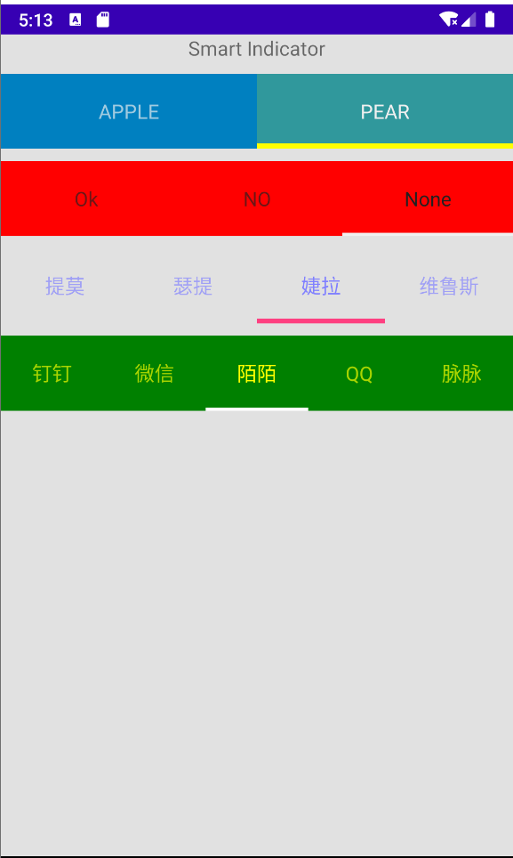

smart-text-indicator
=========================
smart-text-indicator a tool to add indicators for your textView;.



## Including in your project

##### smart-text-indicator to your project

    1.Copy the smart-text-indicator/library folder to the project directory

    2.Modify settings.gradle under the project and add the dependency on this module as follows:

    include ':demo', ':mylibrary'

    3. Introduce the dependency of the module under the project.  you need to modify the build.gradle file under the main module to add the dependency:

   implementation project(path: ':mylibrary')

    Solution 2: to be done

More on the  configuration can be found in the Project.

Usage
-----
Define in xml like as follow
Sample code:
```xml
           <heli.mrc.smartIndicator.SmartIndicator
        android:id="@+id/t1"
        android:layout_width="match_parent"
        android:layout_height="wrap_content"
        android:layout_marginTop="10dp"
        android:background="#0080C0"
        android:minHeight="60dp"
        app:accent_Color="#FFFF00"
        app:indicatorHeight="4dp"
        app:textLightColor="#F0F0F0">

        <TextView
            android:layout_width="wrap_content"
            android:layout_height="wrap_content"
            android:gravity="center"
            android:text="APPLE"
            android:textSize="16sp"></TextView>


        <TextView
            android:layout_width="wrap_content"
            android:layout_height="wrap_content"
            android:gravity="center"
            android:text="PEAR"
            android:textSize="16sp"></TextView>


    </heli.mrc.smartIndicator.SmartIndicator>
```

You  can also  change the accent_Color and textLightColor  properties by `setAccentColor` and `setTextLightColor` method.
Here is sample code:

```java
        ((SmartIndicator)findViewById(R.id.smartIndicator2)).setTextLightColor(Color.YELLOW);
        ((SmartIndicator)findViewById(R.id.smartIndicator2)).setAccentColor(Color.GREEN);
```
If you dont specify indicatorHeight  the default values will be used

Credits
-------
Author:
* heli Mrc


License
-------
    The MIT License (MIT)

    Copyright (c) 2014 heli Mrc

    Permission is hereby granted, free of charge, to any person obtaining a copy
    of this software and associated documentation files (the "Software"), to deal
    in the Software without restriction, including without limitation the rights
    to use, copy, modify, merge, publish, distribute, sublicense, and/or sell
    copies of the Software, and to permit persons to whom the Software is
    furnished to do so, subject to the following conditions:

    The above copyright notice and this permission notice shall be included in all
    copies or substantial portions of the Software.

    THE SOFTWARE IS PROVIDED "AS IS", WITHOUT WARRANTY OF ANY KIND, EXPRESS OR
    IMPLIED, INCLUDING BUT NOT LIMITED TO THE WARRANTIES OF MERCHANTABILITY,
    FITNESS FOR A PARTICULAR PURPOSE AND NONINFRINGEMENT. IN NO EVENT SHALL THE
    AUTHORS OR COPYRIGHT HOLDERS BE LIABLE FOR ANY CLAIM, DAMAGES OR OTHER
    LIABILITY, WHETHER IN AN ACTION OF CONTRACT, TORT OR OTHERWISE, ARISING FROM,
    OUT OF OR IN CONNECTION WITH THE SOFTWARE OR THE USE OR OTHER DEALINGS IN THE
    SOFTWARE.

